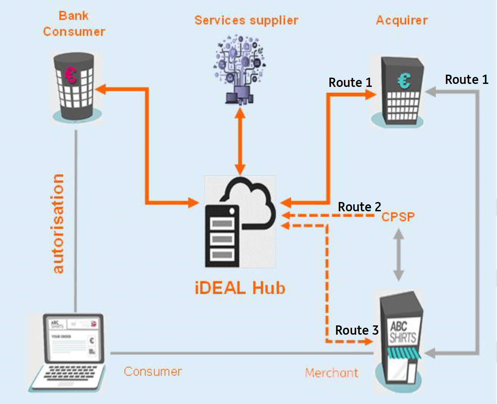

# Pronamic Pay - iDEAL 2.0

This repository contains the Pronamic Pay integration for the new iDEAL.

https://ideal-portal.ing.nl/idealDeveloperPortal/the-new-ideal

> ## The new iDEAL
> 
> iDEAL already exists for over 15 years and is the dominant online payment method in the Netherlands. To remain successful in the future both UX (User Experience) and use cases of iDEAL as well as the technical infrastructure need to be improved.
> 
> ### 1. What's New?
> 
> With the new iDEAL a few important fundamentals of iDEAL will change.
> 
> #### User Profile
> 
> The starting point of the new iDEAL has been to improve the checkout process of users and to improve overall conversion. Furthermore, there is a strong demand for additional services in which a payment is combined with for example age verification and loyalty. Therefore, at the heart of this improvement is a centrally managed user profile where users can store their preferred bank account as well as store other information like address details and in the future information like loyalty IDs. For an optimal experience iDEAL will make use of cookies to recognize the user in any checkout process and will request directly (via push notifications) a payment confirmation from the user. The profile is stored and managed by iDEAL/Currence and via the bank app the user can enter their profile for adjustments.
> 
> #### Bank Selection
> 
> As the preferences of the user are managed in the user profile, the bank selection page will disappear from the merchant environment. For the user with a profile their preferred bank account (IBAN) will be used. Users without a profile will get a bank selection page provided by iDEAL (Currence).
> 
> #### User Token
> 
> As a merchant you can also request a so-called user token, which is a unique identifier for the user. In this way you can directly show the user their preferred bank account in your webshop.
> 
> #### Fast Checkout (Snel Bestellen)
> 
> One of the first additional (and optional) services is Fast Checkout. If a user pays with Fast Checkout, you as a merchant will not only receive a confirmation of payment but you will also receive the user's address details from the iDEAL Hub. In this way you can facilitate a Fast Checkout where the user only clicks the iDEAL Fast Checkout button and directly confirms the payment, without filling in their address details at your webshop.
> 
> #### Future Value Added Services
> 
> The new iDEAL is set-up in such a way that future Value Added Services can be added more easily. These can be new payment methods offered throughout the iDEAL ecosystem, like recurring payments and Buy Now Pay Later. But also Value Added Services like loyalty and a purchase protection insurance offered by third parties.
> 
> ### 2. Ecosystem
> 
> To facilitate these new features as well as to enhance security and easy integration in the future, the iDEAL payment landscape and all parts involved will need a major technical upgrade. Furthermore, Currence as scheme owner of iDEAL will get an active technical role.
> 
> #### iDEAL Hub (or iDEAL Access Point)
> 
> In order to facilitate these features and to be a platform for future Value Added Services, iDEAL needs a central connection point to recognize the iDEAL users. This will be the iDEAL Hub managed by iDEAL/Currence. In the figure below an overview is provided of the roles in the iDEAL ecosystem. The iDEAL Hub can be accessed via three routes:
> 
> - Route 1 - this is the traditional route, where the merchant connects via the acquirer platform
> - Route 2 - the route where the CPSP connects directly to the iDEAL Hub
> - Route 3 - the route where the merchant connects directly to the iDEAL Hub.
> 
> 
> 
> #### Direct connection (Route 2 & 3) for CPSPs and ING merchants
> 
> To provide the best performance ING chooses to provide the direct routes 2 and 3 for CPSPs and merchants (instead of route 1). You will still have a contract for iDEAL with ING, but your transactions are directly submitted to the iDEAL Hub. To be correctly identified/authorized at the iDEAL Hub you will need to periodically retrieve a so-called iDEAL Access Token from the acquirer. The direct connection reduces the number of components in the chain, improving reliability and overall response times. And it will also provide a better payment experience for your customers. Furthermore, when new Value Added Services are deployed by Currence, they will be instantly technically available and there will be no dependency on the ING development roadmap.
> 
> #### API
> 
> All interaction will take place through APIs both towards the iDEAL Hub and towards the ING iDEAL platform. Details of the API are described on the [getting started page](https://ideal-portal.ing.nl/idealDeveloperPortal/getting-started).
> 
> ### 3. iDEAL Payments
> 
> At the core of the new iDEAL is the iDEAL payment. More information on this functionality can be found in the [Currence documentation](https://currencenl.atlassian.net/wiki/spaces/IPD/pages/3417604276/iDEAL+Payment+for+Direct+Connection).
> 
> ### 4. iDEAL User Token
> 
> To recognize a User directly (and show their preferred IBAN) in the merchant environment you can request an iDEAL User Token. More information on this functionality can be found in the [Currence documentation](https://currencenl.atlassian.net/wiki/spaces/IPD/pages/3417604301/Enhanced+iDEAL+Payment+flow+with+User+Token+for+Direct+Connection).
> 
> ### 5. iDEAL Checkout (Snel Bestellen)
> 
> For guest shoppers you can facilitate a faster checkout, where the User can share their address details stored in the iDEAL profile. This makes the checkout even more seamless. More information of this payment functionality can be found in the [Currence documentation](https://currencenl.atlassian.net/wiki/spaces/IPD/pages/3417604255/Payment+with+iDEAL+Checkout+for+Direct+Connection).

## Links

- https://ing.nl/hetnieuweideal
- https://www.ing.nl/zakelijk/geld-ontvangen/het-nieuwe-ideal
- https://www.ingwb.com/en/service/payments-and-collections/the-new-ideal
- https://ideal-portal.ing.nl/
- https://sandbox.ideal-portal.ing.nl/
- https://ideal-portal.ing.nl/idealDeveloperPortal
- https://currencenl.atlassian.net/wiki/spaces/IPD/pages/521928709/New+iDEAL+-+Implementation+docs
- https://currencenl.atlassian.net/wiki/spaces/IPD/pages/3432972289/Generic+Merchant+info+and+requirements+on+the+New+iDEAL
- https://currencenl.atlassian.net/wiki/spaces/IPD/pages/3417604144/Implementation+Guide+for+iDEAL+Merchant+CPSP+Direct+Connection
- https://currencenl.atlassian.net/wiki/spaces/IPD/pages/3417538771/API+s+for+Direct+Connection+Merchant+CPSP
